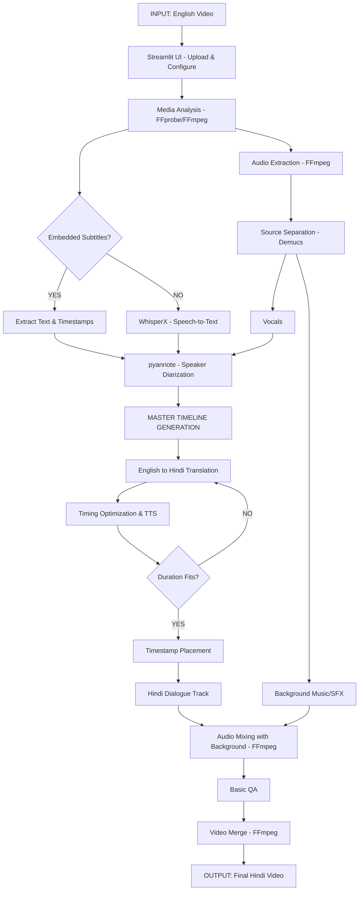

# AI-Based English-to-Hindi Video Dubbing System

This document outlines the architecture, technology stack, and folder structure for the English-to-Hindi video dubbing project, addressing Outputs 1, 2, and 3 from your master prompt.

## Output 1: Architecture and Data Flow

The system is designed as a modular pipeline where data flows linearly but supports intermediate state checkpoints.



## Output 2: Technology and Model Selection

| Component | Selected Technology | Why Selected | Input | Output | Alternative / Limitiations |
| :--- | :--- | :--- | :--- | :--- | :--- |
| **UI** | Streamlit | Fast prototyping, excellent media playback and file upload components. | User interactions, media files | Configured pipeline run, video rendering | Gradio (alternative); lacks deep UI customization. |
| **Backend** | FastAPI | (Optional usage) High performance, async, good for separating processing from UI state. | HTTP requests | JSON, media files | Flask (alternative); synchronous by default. |
| **Media Processing** | FFmpeg / FFprobe | Industry standard, robust format support, fast processing. | Media files | Extracted streams, metadata | OpenCV/MoviePy (too heavy/slow for basic stream copy). |
| **Audio Separation** | Demucs (HTDemucs) | State-of-the-art vocal/accompaniment separation. | Original Audio | Vocals.wav, Background.wav | Spleeter (older, lower quality). Requires decent RAM/VRAM. |
| **Speech-to-Text** | WhisperX (large-v3) | High accuracy, forces word-level alignment for precise timestamps. | Vocals.wav | JSON with Text + Timestamps | faster-whisper (faster but slightly harder to align). |
| **Speaker Diarization** | pyannote.audio | State-of-the-art for identifying "Who spoke when". | Vocals.wav | Speaker segments with timestamps | WhisperX built-in (often relies on pyannote anyway). |
| **Translation** | IndicTrans2 or Google Translate API / Edge TTS Translation | IndicTrans2 is state-of-the-art for Indian languages. Google/Edge is great for MVP. | English Text | Hindi Text | API limits or local model RAM usage. |
| **Text-to-Speech (TTS)** | Edge-TTS (Local/Free) or ElevenLabs (Premium) | Edge-TTS provides very good natural Hindi voices without API costs for initial testing. | Hindi Text + target duration | Hindi Audio (WAV/MP3) | ElevenLabs is much more natural but has high API cost. |
| **State Management** | JSON Checkpoints | Simple, human-readable, easily debuggable. | Python Dicts | `pipeline_state.json` | SQLite (heavier, harder to debug manually). |

> [!NOTE]
> For the initial MVP (Phase 1), we will use faster/simpler alternatives like **Edge-TTS** and **Edge Translate / Google Translate** to ensure we can build the end-to-end pipeline quickly without getting blocked by heavy local model downloads (like loading large-v3 or IndicTrans2 locally), which we can swap in easily due to the modular design.

## Output 3: Folder Structure

The repository will be structured exactly as requested to maintain clean separation of concerns:

```text
ai-video-dubbing/
├── README.md
├── requirements.txt
├── .env.example
├── .gitignore
├── config.py
├── run.py
├── app/
│   ├── frontend/
│   └── api/
├── pipeline/
│   ├── stages/
│   └── dubbing_pipeline.py
├── providers/
│   ├── translation/
│   └── tts/
├── services/
├── models/
├── utils/
├── data/
└── tests/
```

## Next Steps

1. Setup the initial Python environment, install required packages (`ffmpeg-python`, `streamlit`, `whisperx`, `demucs`, etc.).
2. Create the folder structure and scaffolding.
3. **Execute Phase 1**: Basic working dub (Video -> FFmpeg Audio -> WhisperX -> Translate -> TTS -> Alignment -> Merge).

## User Review Required

> [!IMPORTANT]
> Please review the technology choices (especially the use of Edge-TTS/Translate for the initial MVP to guarantee swift progress without getting bogged down by model weights, which we can swap to heavy models later). If you approve, I will proceed with creating the folder structure and implementing **Phase 1**.
