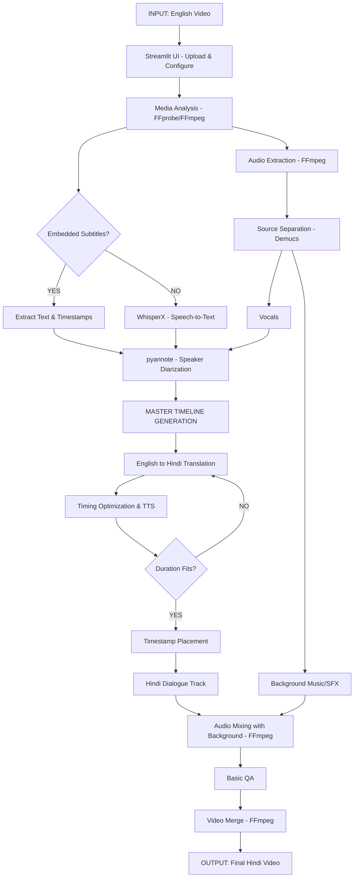

# AI-Based English-to-Hindi Video Dubbing System

This document outlines the architecture, technology stack, and folder structure for the English-to-Hindi video dubbing project, addressing Outputs 1, 2, and 3 from your master prompt.

## Output 1: Architecture and Data Flow

The system is designed as a modular pipeline where data flows linearly but supports intermediate state checkpoints.



## Output 2: Technology and Model Selection

| Component | Selected Technology | Why Selected | Input | Output | Alternative / Limitiations |
| :--- | :--- | :--- | :--- | :--- | :--- |
| **UI** | Streamlit | Fast prototyping, excellent media playback and file upload components. | User interactions, media files | Configured pipeline run, video rendering | Gradio (alternative); lacks deep UI customization. |
| **Backend** | FastAPI | (Optional usage) High performance, async, good for separating processing from UI state. | HTTP requests | JSON, media files | Flask (alternative); synchronous by default. |
| **Media Processing** | FFmpeg / FFprobe | Industry standard, robust format support, fast processing. | Media files | Extracted streams, metadata | OpenCV/MoviePy (too heavy/slow for basic stream copy). |
| **Audio Separation** | Demucs (HTDemucs) | State-of-the-art vocal/accompaniment separation. | Original Audio | Vocals.wav, Background.wav | Spleeter (older, lower quality). Requires decent RAM/VRAM. |
| **Speech-to-Text** | WhisperX (large-v3) | High accuracy, forces word-level alignment for precise timestamps. | Vocals.wav | JSON with Text + Timestamps | faster-whisper (faster but slightly harder to align). |
| **Speaker Diarization** | pyannote.audio | State-of-the-art for identifying "Who spoke when". | Vocals.wav | Speaker segments with timestamps | WhisperX built-in (often relies on pyannote anyway). |
| **Translation** | IndicTrans2 or Google Translate API / Edge TTS Translation | IndicTrans2 is state-of-the-art for Indian languages. Google/Edge is great for MVP. | English Text | Hindi Text | API limits or local model RAM usage. |
| **Text-to-Speech (TTS)** | Edge-TTS (Local/Free) or ElevenLabs (Premium) | Edge-TTS provides very good natural Hindi voices without API costs for initial testing. | Hindi Text + target duration | Hindi Audio (WAV/MP3) | ElevenLabs is much more natural but has high API cost. |
| **State Management** | JSON Checkpoints | Simple, human-readable, easily debuggable. | Python Dicts | `pipeline_state.json` | SQLite (heavier, harder to debug manually). |

> [!NOTE]
> For the initial MVP (Phase 1), we will use faster/simpler alternatives like **Edge-TTS** and **Edge Translate / Google Translate** to ensure we can build the end-to-end pipeline quickly without getting blocked by heavy local model downloads (like loading large-v3 or IndicTrans2 locally), which we can swap in easily due to the modular design.

## Output 3: Folder Structure

The repository will be structured exactly as requested to maintain clean separation of concerns:

```text
ai-video-dubbing/
├── README.md
├── requirements.txt
├── .env.example
├── .gitignore
├── config.py
├── run.py
├── app/
│   ├── frontend/
│   └── api/
├── pipeline/
│   ├── stages/
│   └── dubbing_pipeline.py
├── providers/
│   ├── translation/
│   └── tts/
├── services/
├── models/
├── utils/
├── data/
└── tests/
```

## Next Steps

1. Setup the initial Python environment, install required packages (`ffmpeg-python`, `streamlit`, `whisperx`, `demucs`, etc.).
2. Create the folder structure and scaffolding.
3. **Execute Phase 1 & 2**: Basic working dub with Demucs background preservation.
4. **Execute Phase 3**: Integrate ElevenLabs API for high-quality TTS and implement Timing Optimization (Speed Matching) to ensure translated dialogue fits the original time slots.
5. **Execute Phase 4 (Current)**: Implement the **AI Voice Selection Agent**.

## User Review Required: AI Voice Selection Agent

> [!IMPORTANT]
> **Voice Analysis Approach:**
> You requested an AI agent to analyze pitch, tone, age, and deepness to select the best ElevenLabs voice. 
> 
> Here is my proposed architecture for this agent:
> 1. **Voice Catalog**: We will define a dictionary of 4-6 pre-selected ElevenLabs Voice IDs categorized by Gender (Male/Female) and Tone (Deep/Young/Mature).
> 2. **Audio Analysis**: I will create a `VoiceSelectionAgent` using `librosa` (a python audio analysis library). It will analyze a 5-second sample of each speaker to calculate their **Fundamental Frequency (F0/Pitch)** and **Spectral Centroid (Tone/Brightness)**.
>    - High Pitch (>165Hz) -> Female Voice
>    - Low Pitch (<165Hz) -> Male Voice
>    - Low Spectral Centroid -> Deep/Mature Tone
>    - High Spectral Centroid -> Young/Bright Tone
> 3. **Dynamic Assignment**: The agent will automatically assign the best matching ElevenLabs Voice ID to each speaker (`SPEAKER_00`, `SPEAKER_01`, etc.) in the master timeline.
> 4. **TTS Update**: The `TTSGenerator` will read this mapped Voice ID instead of using a hardcoded voice.
> 
> *Alternatively*, if you have an API key for OpenAI or Gemini, we could send the audio to a multimodal LLM to classify the age and emotion. However, the `librosa` (pitch/tone analysis) approach is fast, free, and runs entirely locally!
>
> Please confirm if the `librosa` audio analysis approach works for your vision of the Voice Selection Agent!

> [!IMPORTANT]
> **ElevenLabs Integration & API Key**: To use ElevenLabs for TTS, you will need to provide an `ELEVENLABS_API_KEY`. I will update the code to pull this from the `.env` file. You must add your API key there.
>
> **Regarding Lip Sync**: As per the Master Prompt, actual visual Lip Sync (modifying the video frames using Wav2Lip) is considered "Future Scope". For now, we will implement **Timing Optimization**, which adjusts the *speed* of the generated Hindi audio to match the original duration perfectly. This will fix the overlapping and out-of-sync audio issues.
> 
> If you approve this approach, I will:
> 1. Install the `elevenlabs` package.
> 2. Create the ElevenLabs TTS provider.
> 3. Implement the `TimingOptimizer` using FFmpeg's `atempo` filter to dynamically match sentence speeds.
